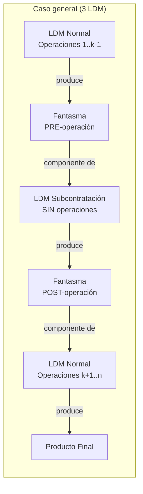

# BORRADOR — Módulo de Subcontratación Nativa Asistida (Opción 5)

> **Estado: EN EVOLUCIÓN (post-implementación).** El Hito 1 (motor + asistentes + PLM + modo
> masivo + accesos rápidos) está construido, probado (25/25 tests) y desplegado en staging2
> (`econovo-pruebas2.odoo.com`, módulo `econovo_mrp_subcontracting_wizard`). El Hito 2
> (coexistencia Interno/Subcontratado) también está construido y probado. Ver sección 11 para el
> detalle completo de los 3 Hitos, sus criterios de aceptación y su estado real. Las secciones 0
> a 10 quedan como registro histórico del diseño original (Revisión 3) — ya no reflejan el único
> mecanismo disponible (ver sección 11.2 para lo que cambió).

**Fecha**: 2026-09-21 (creación) — Revisión 2: 2026-09-22 — Revisión 3: 2026-09-22 —
**Revisión 4: 2026-09-28** (post-implementación: Hitos 1 y 2 completos, ver sección 11)
**Precede a este documento**: análisis del módulo `mrp_workorder_subcontracting` (AvanzOSC) y las
5 propuestas arquitectónicas — ver `/memories/repo/mrp_workorder_subcontracting_migration_eval.md`
y `/memories/repo/mrp_subcontracting_native_mechanism_and_proposals.md` en la memoria del repo.
El registro detallado de la construcción real (bugs encontrados, comandos de test, datos reales
de staging) vive en `/memories/repo/econovo_mrp_subcontracting_wizard.md`.

> **Terminología (Revisión 3)**: de acá en adelante se reemplazan los términos coloquiales
> "convertir/conversión" y "desconvertir/desconversión" por los términos estándar de la industria
> de manufactura/ERP: **Externalización** (outsourcing — pasar una operación de fabricación
> interna a un proveedor) e **Internalización** (insourcing — volver a hacerla en planta). Es el
> mismo par que usan SAP/Oracle y la literatura de gestión de operaciones en general.

> **Decisiones tomadas en la Revisión 2 (2026-09-22)**:
> 1. **Nomenclatura de fantasmas** → confirmada **Alternativa A1** (catálogo dedicado
>    `mrp.routing.operation.category`) — **refinada en Revisión 3**, ver sección 5.
> 2. **Reversibilidad** → se descartó B1 (archivar/reactivar la LDM original). Reemplazada por
>    la Internalización (motor de fusión), ver sección 3.6.
> 3. **Armonía con PLM** → selector de integración con ECO, ver sección 3.7.

> **Decisiones tomadas en la Revisión 3 (2026-09-22)**:
> 1. **Nombre del módulo confirmado**: `econovo_mrp_subcontracting_wizard` (pregunta 10.1).
> 2. **Selector de PLM reducido a 2 opciones** (se elimina `'none'` — todo cambio de modalidad
>    pasa SIEMPRE por una ECO): `validated` (por defecto) y `auto`. Ver sección 3.7.
> 3. **Motor de Internalización**: se presentan 3 alternativas concretas (sección 3.6) —
>    pendiente de elección.
> 4. **Nomenclatura de fantasmas — patrón definitivo** confirmado con un ejemplo real (Corte
>    Láser → Plegado → Zincado): el sufijo de cada fantasma es el código de la categoría de la
>    ÚLTIMA operación que efectivamente se le hizo a esa pieza, no un sufijo arbitrario A/B. Ver
>    sección 5.
> 5. **Nuevo grupo de seguridad dedicado** (no se reutiliza `mrp.group_mrp_manager` en exclusiva)
>    — ver sección 7.
> 6. **Re-verifiqué staging en vivo** (2026-09-22, MCP, solo lectura) antes de seguir — ver
>    sección 0.1: hay novedades reales respecto del checklist original.

---

## 0. Contexto operativo real detectado (esto ya está pasando hoy)

Antes de diseñar nada, encontré `GITHUB-SRC/docs/checklist_subcontratacion_reabastecer.txt` — un
checklist
manual que ya está en uso para configurar subcontratación **nativa** en staging
(`econovo-pruebas.odoo.com`, BD `econovo-180326`). Esto cambia el enfoque: **no partimos de cero,
partimos de un proceso manual real que hay que automatizar.**

Estado real encontrado:
- **Piloto ya configurado**: LDM id 521, `[5RC1712010] CONJUNTO GUILLOTINA IZQ RC 17/21`,
  subcontratista **Brogar S.H.** (partner id 75449), 3 componentes, cada uno con la ruta
  "Oscar Scorza Equipos y Servicios: Subcontratista de reabastecimiento" (ruta id 164) aplicada
  a mano.
- **6 LDMs pendientes de convertir**, con el MISMO proveedor, algunas MUY grandes:
  - id 522 — 3 componentes
  - id 744 — 2 componentes
  - id 747 — 7 componentes
  - id 592 — **~40 componentes**
  - id 520 — **~70 componentes**
  - id 45798 — **~70 componentes**
- El checklist manual son **6 pasos**, y el paso 5 ("agregar la ruta de reabastecimiento a CADA
  componente") hay que repetirlo **por cada componente de cada LDM** — para la LDM 520 son ~70
  repeticiones manuales de la misma acción.
- El propio checklist ya documenta el riesgo/gotcha central: *"Si un componente NO tiene esta
  ruta, Odoo no generará el picking de salida para ese componente"* — es un fallo **silencioso**,
  no hay ningún error visible cuando falta.

**Conclusión**: el "asistente" de la Opción 5 no es una idea abstracta — tiene un objetivo
inmediato, real y medible: **terminar las 6 LDMs pendientes sin repetir 70 clics manuales por
LDM, y sin dejar ningún componente con la ruta faltante sin que nadie se dé cuenta.** Eso ya
justifica la Fase 1 del rollout (sección 8) antes de tocar el caso más difícil (operación
intermedia tipo "zincado").

### 0.1 Re-verificación en staging (2026-09-22, vía MCP, solo lectura)

Antes de seguir, volví a consultar el estado REAL de staging (`econovo-pruebas.odoo.com`) en vez
de confiar en el checklist ya leído. Hay novedades:

- **La LDM 521 (el "piloto ya configurado" según el checklist) HOY está en `type='phantom'`
  (Kit), con `subcontractor_ids` vacío** — NO está en `type='subcontract'` como decía el
  checklist. Lo mismo para 522 y 744/747. No puedo confirmar por qué (¿se revirtió a mano? ¿el
  checklist documentaba un plan que nunca se terminó de aplicar?) — lo importante es que **no
  hay que asumir que el piloto sigue en pie**: hay que re-confirmarlo con el equipo antes de
  usarlo como "control de calidad" en la Fase 1. Dicho de otra forma: esto ya nos pasó una vez
  en la práctica sin que exista ninguna herramienta prolija para manejarlo — es la mejor prueba
  de que la Internalización (sección 3.6) hace falta de verdad.
- **La LDM 592 (una de las "6 pendientes") está inactiva, pero NO es un problema**: fue
  reemplazada normalmente por la LDM **59480** (mismo producto, `type='subcontract'`, mismo
  subcontratista Brogar, activa) — ese producto **ya está resuelto**, solo que con un id de LDM
  distinto al que teníamos anotado.
- **520 y 45798 siguen correctamente configuradas** (`type='subcontract'`, subcontratista Brogar,
  activas) — sin cambios respecto de lo ya reportado.
- **Encontré casos reales para el ejemplo de la sección 10.2/10.3** (Corte Láser + Plegado en
  planta, candidatos a agregarles Zincado externalizado más adelante) — docenas de productos
  reales siguen exactamente el patrón `CORTE LASER (seq 100, CT "LASER") → PLEGADO (seq 101, CT
  "PLEGADORA 2"/"PLEGADO")`, por ejemplo `4CVR160703`, `4CC0009017`, `4SD0201077`,
  `4CH0002004`, `4XCA051203`, `4RC1705176`, `4BAE608104/106/108/109`, `4BAE607030`,
  `4BAE608121/124`, `4BA0008448`, entre otros. **Ninguno tiene todavía una operación "Zincado"**
  (no existe ese nombre de operación en ningún lado de staging) — confirma que el caso de la
  sección 10.3 es 100% hipotético hoy, pero perfectamente realista: cualquiera de estos productos
  es un candidato real y disponible para la Fase 2.

---

## 1. Replanteo de "Modo A / Modo B" — es UN solo mecanismo, no dos

En la ronda anterior hablé de "Modo A: producto completo" y "Modo B: operación intermedia" como
si fueran dos casos distintos. Profundizando: **son el mismo mecanismo con distinta cantidad de
LDMs generadas**, según dónde caiga la operación subcontratada dentro de la ruta completa del
producto final. Esto simplifica el diseño: el asistente no pregunta "¿modo A o B?", pregunta
**"¿qué operaciones hay antes y después de la que querés subcontratar?"** y calcula solo cuántas
LDMs/productos fantasma hacen falta:

| Operaciones ANTES | Operaciones DESPUÉS | LDMs resultantes | Fantasmas nuevos | Caso real |
|---|---|---|---|---|
| Ninguna | Ninguna | 1 (subcontract) | 0 | El caso del checklist actual — "CONJUNTO GUILLOTINA" completo |
| Ninguna | Sí | 2 (subcontract → normal) | 1 (producto post-operación) | Caso A, sección 1.1 (se externaliza la PRIMERA operación) |
| Sí | Ninguna | 2 (normal → subcontract) | 1 (producto pre-operación) | Caso C, sección 1.1 (se externaliza la ÚLTIMA operación) |
| Sí | Sí | 3 (normal → subcontract → normal) | 2 (pre y post operación) | Caso B, sección 1.1 (se externaliza una operación DEL MEDIO) |



El caso "0 y 0" (fila 1 de la tabla) es el que YA tienen configurado a mano en el piloto — por
eso la Fase 1 (sección 8) da valor inmediato con la parte MÁS SIMPLE del mecanismo, antes de
necesitar generar ningún producto fantasma nuevo.

### 1.1 Ejemplos completos por posición (misma ruta física, cambia SOLO cuál operación se externaliza)

Usando siempre la misma ruta de 3 operaciones (Corte Láser → Plegado → Zincado) para que se vea
claro que la regla de nomenclatura (sección 5) NO cambia según la posición — solo cambia CUÁL
operación queda marcada como externa.

**Caso A — se externaliza CORTE LASER (primera operación)**
```
01 - CODIGOXXX-CL - CORTE LASER (CL) - EXTERNO   (se entrega la materia prima cruda al proveedor)
   → vuelve como CODIGOXXX-CL (picking de ingreso; todavía faltan Plegado y Zincado)
02 - CODIGOXXX-CL - PLEGADO (PL)     - INTERNO   ┐ misma LDM/OF: consume CODIGOXXX-CL,
03 - CODIGOXXX-CL - ZINCADO (ZN)     - INTERNO   ┘ produce el final CODIGOXXX directo
```
- Fila de la tabla: **"Ninguna antes / Sí después"**. LDMs: 2 (`subcontract` para CL, `normal`
  con Plegado+Zincado para el resto). Fantasmas: 1 (`CODIGOXXX-CL`, sufijo = código de la
  operación EXTERNALIZADA, porque no hay ninguna operación interna previa que defina otro estado).

**Caso B — se externaliza PLEGADO (operación del medio) — el caso que preguntaste**
```
01 - CODIGOXXX-CL - CORTE LASER (CL) - INTERNO   (LDM normal, produce y stockea CODIGOXXX-CL)
02 - CODIGOXXX-CL - PLEGADO (PL)     - EXTERNO   (se entrega CODIGOXXX-CL al proveedor)
   → vuelve como CODIGOXXX-PL (picking de ingreso; todavía falta Zincado)
03 - CODIGOXXX-PL - ZINCADO (ZN)     - INTERNO   (LDM normal, consume CODIGOXXX-PL, produce CODIGOXXX final)
```
- Fila de la tabla: **"Sí antes / Sí después"** (el caso general). LDMs: 3 (`normal` para Corte
  Láser, `subcontract` para Plegado, `normal` para Zincado). Fantasmas: 2 — `CODIGOXXX-CL`
  (pre-operación, sufijo = última operación interna antes de la entrega = Corte Láser) y
  `CODIGOXXX-PL` (post-operación, sufijo = la operación EXTERNALIZADA = Plegado, porque es lo
  último que se le hizo a la pieza al volver).

**Caso C — se externaliza ZINCADO (última operación) — el ejemplo original**
```
01 - CODIGOXXX-PL - CORTE LASER (CL) - INTERNO   ┐ misma LDM/OF, produce y stockea CODIGOXXX-PL
02 - CODIGOXXX-PL - PLEGADO (PL)     - INTERNO   ┘
03 - CODIGOXXX-PL - ZINCADO (ZN)     - EXTERNO   (se entrega CODIGOXXX-PL al proveedor)
   → vuelve como CODIGOXXX (picking de ingreso, SIN guion: es la pieza final real)
```
- Fila de la tabla: **"Sí antes / Ninguna después"**. LDMs: 2 (`normal` con Corte Láser+Plegado,
  `subcontract` para Zincado). Fantasmas: 1 (`CODIGOXXX-PL`, sufijo = última operación interna =
  Plegado — `CODIGOXXX` final NO es un fantasma, ya existía).

**La regla se sostiene sin excepciones en los 3 casos**: el sufijo de cada fantasma es siempre el
código de la ÚLTIMA operación efectivamente realizada para llegar a ese estado — nunca depende
de si esa operación fue la primera, del medio, o la última de la ruta completa.

**Al Internalizar cualquiera de los 3 casos, el resultado converge al mismo lugar** — no importa
CUÁL operación se había externalizado, Internalizar siempre reconstruye UNA sola LDM normal con
las 3 operaciones en su orden original (restaurando la que estaba externa, en el CT que
corresponda según `original_workcenter_id`), y una sola pieza final `CODIGOXXX` sin fantasmas —
exactamente como si nunca se hubiera externalizado nada:

| Caso externalizado | LDM(s) antes de Internalizar | LDM después de Internalizar |
|---|---|---|
| A (Corte Láser) | `subcontract`(CL) → `normal`(PL, ZN) | `normal`(CL, PL, ZN) — 1 sola LDM |
| B (Plegado) | `normal`(CL) → `subcontract`(PL) → `normal`(ZN) | `normal`(CL, PL, ZN) — 1 sola LDM |
| C (Zincado) | `normal`(CL, PL) → `subcontract`(ZN) | `normal`(CL, PL, ZN) — 1 sola LDM |

El motor de fusión (sección 3.6) no necesita ningún caso especial por posición: siempre inserta
la operación restaurada entre las de `bom_pre` (si hay) y las de `bom_post` (si hay) — sin
`bom_pre` va primera, sin `bom_post` va última, con ambas va en el medio.

---

## 2. Objetivo y límites del módulo (Opción 5)

**Objetivo**: un asistente guiado + un tablero de trazabilidad que reproduce, paso a paso, el
checklist manual de la sección 0 — sin automatizar la generación en segundo plano (eso queda
para una eventual Opción 1/2 futura, ver sección 9). Cada corrida del asistente es un acto
explícito de un planificador, revisable antes de confirmar.

**Lo que el módulo SÍ hace**:
- Guía la configuración de una cadena de subcontratación (1, 2 o 3 LDMs según la tabla de arriba).
- Genera automáticamente el/los producto(s) fantasma necesarios (solo en los casos que lo
  requieren), con nomenclatura y categoría consistentes, ocultos del catálogo normal.
- Recorre TODOS los componentes de la LDM de subcontratación y aplica la ruta de reabastecimiento
  correcta (la de la company/warehouse activos) — con previsualización antes de aplicar.
- Configura el proveedor (`product.supplierinfo`) y la ruta "Comprar" del producto ancla.
- Deja un registro (`mrp.subcontracting.chain`) para que cualquiera pueda ver, más adelante, el
  estado completo de esa cadena (LDMs, productos, OCs, recepciones, reabastecimientos) sin tener
  que recordar cuál es el "-1" de qué.
- Corre una verificación final equivalente al paso 6 del checklist.

**Lo que el módulo NO hace** (ver sección 9 para la evolución futura):
- No toca `stock.move`/`mrp.production` en caliente. No cambia el comportamiento nativo de
  compras/recepción/facturación en absoluto — usa el motor nativo tal cual está.
- No decide solo si algo "debería" subcontratarse — siempre es un planificador quien dispara el
  asistente.
- No re-sincroniza automáticamente si la LDM original cambia después (eso es una limitación
  aceptada de esta opción, documentada en la sección 6).

---

## 3. Modelos propuestos

### 3.1 `mrp.subcontracting.chain` (registro de trazabilidad — el "tablero")

| Campo | Tipo | Notas |
|---|---|---|
| `name` | Char | Auto (`ir.sequence`), ej. `SBC-2026-00001` |
| `company_id` | Many2one `res.company` | `required=True` |
| `warehouse_id` | Many2one `stock.warehouse` | Almacén cuya ruta de reabastecimiento se usó |
| `subcontractor_id` | Many2one `res.partner` | El subcontratista |
| `final_product_tmpl_id` | Many2one `product.template` | El producto final real (nunca fantasma) |
| `anchor_product_tmpl_id` | Many2one `product.template` | El producto que se compra en la OC (= `final_product_tmpl_id` en el caso trivial, o el fantasma post-operación en los demás) |
| `bom_ids` | Many2many `mrp.bom` (computado, no editable) | Las 1-3 LDMs generadas/vinculadas |
| `phantom_product_tmpl_ids` | Many2many `product.template` (computado) | Los fantasmas creados (0, 1 o 2) |
| `component_line_ids` | One2many `mrp.subcontracting.chain.component` | Snapshot de componentes + estado de ruta |
| `state` | Selection `draft/externalized/internalized` | `internalized` = se corrió la Internalización (sección 3.6); el registro NUNCA se borra, queda como historial |
| `internalized_bom_id` | Many2one `mrp.bom` | Solo si `state='internalized'` — la LDM normal única resultante de la fusión |
| `original_workcenter_id` | Many2one `mrp.workcenter` | Snapshot tomado al externalizar — CT donde vivía la operación antes, para restaurarla al internalizar |
| `original_sequence` / `original_time_mode` / `original_time_cycle_manual` | Integer / Selection / Float | Resto del snapshot de la operación original (mismos campos que `mrp.routing.workcenter`) |
| `eco_ids` | One2many `mrp.eco` | ECOs creadas por este módulo para esta cadena (Externalización y/o Internalización) — siempre hay al menos una, ya que `eco_handling` ya no admite saltear la ECO (sección 3.7) |
| `validated_by_id` / `validated_date` | Many2one `res.users` / Datetime | Solo si alguna ECO de esta cadena se creó con `eco_handling='validated'` — quién y cuándo autorizó saltear la aprobación manual (pregunta 10.6) |
| `last_verified_date` | Datetime | Última vez que se corrió la verificación (paso 6) |
| `po_count` / `receipt_count` / `resupply_count` | Integer (computado) | Para smart buttons |
| `warning_count` | Integer (computado) | Componentes con ruta faltante detectados en la última verificación |

Métodos clave:
- `action_open_wizard_reverify()` — relanza el asistente en modo "solo verificar" (paso 6) sobre
  una cadena existente, útil si alguien agregó un componente nuevo a la LDM después.
- `action_open_internalization_wizard()` — abre el asistente de Internalización (sección 3.6)
  sobre esta cadena.
- `action_view_purchase_orders()` / `action_view_receipts()` / `action_view_resupplies()` —
  smart buttons, dominios sobre `purchase.order`/`stock.picking` filtrando por
  `anchor_product_tmpl_id` y `subcontractor_id`.
- `_compute_warning_count()` — recorre `component_line_ids` buscando rutas faltantes (mismo
  chequeo que el asistente, reutilizable).

### 3.2 `mrp.subcontracting.chain.component` (línea hija — checklist de componentes)

| Campo | Tipo | Notas |
|---|---|---|
| `chain_id` | Many2one `mrp.subcontracting.chain` | |
| `product_tmpl_id` | Many2one `product.template` | El componente real (nunca un fantasma) |
| `has_resupply_route` | Boolean (computado, no almacenado) | `route_ids` incluye la ruta de reabastecimiento del `warehouse_id` de la cadena |
| `route_added_by_wizard` | Boolean | Auditoría: True si el asistente la agregó, False si ya existía |
| `state` | Selection `ok/warning` (computado) | Para pintar ✅/⚠️ en la vista |

### 3.3 Extensiones a modelos existentes

- `product.template`: `is_subcontracting_phantom` (Boolean, `default=False`) — marca los
  fantasmas generados por el módulo. Se usa para (a) excluirlos de las vistas Kanban/buscador de
  catálogo por defecto (dominio `[('is_subcontracting_phantom', '=', False)]` en la acción
  estándar de Productos, vía herencia de acción — **no** tocar la ventana core directamente,
  agregar el dominio en una `ir.actions.act_window` propia o mediante un filtro por defecto), y
  (b) mostrar una cinta ("Fantasma de Subcontratación") en el formulario.
- `mrp.bom`: `subcontracting_chain_id` (Many2one `mrp.subcontracting.chain`, `readonly=True`) —
  referencia inversa para poder ver desde la LDM a qué cadena pertenece (botón/smart button).

### 3.4 El asistente de Externalización — `mrp.subcontracting.externalization.wizard` (TransientModel)

> Es un modelo DISTINTO del asistente de Internalización (sección 3.6) — los pasos y campos de
> cada dirección son lo bastante distintos como para no forzarlos en un solo wizard con muchas
> ramas invisibles.

Un único modelo, con un campo `state` tipo wizard-de-pasos (Selection + botones "Siguiente"/
"Atrás", patrón estándar de wizards Odoo — sin JS custom, todo con vistas nativas):

```python
state = fields.Selection([
    ('setup', 'Configuración inicial'),
    ('precheck', 'Validaciones previas'),
    ('bom_preview', 'Vista previa de LDMs a generar'),
    ('components', 'Rutas de componentes'),
    ('vendor', 'Proveedor y compra'),
    ('done', 'Confirmación'),
], default='setup')
```

**Paso `setup`** — campos: `company_id`, `warehouse_id`, `subcontractor_id`,
`final_product_tmpl_id`, `existing_bom_id` (LDM del producto final ya existente, si la hay),
`operation_id` (Many2one `mrp.routing.workcenter`, opcional — la operación puntual a
subcontratar; vacío = "todo el producto", que es el caso trivial de la sección 1).
El wizard calcula on-change cuántas operaciones hay antes/después de `operation_id` dentro de
`existing_bom_id.operation_ids` (ordenadas por `sequence`) y muestra un mensaje tipo:
*"Esta configuración generará 1 LDM de subcontratación + 1 producto fantasma (post-operación).
No se tocará ninguna LDM ni operación existente hasta que confirmes en el paso final."*

**Paso `precheck`** — validaciones no bloqueantes, con botón "Corregir" al lado de cada una:
- ¿Está activo el ajuste "Subcontratación" en Manufactura › Configuración › Ajustes? (lee
  `res.config.settings`/`ir.config_parameter` correspondiente; botón lo activa con un solo clic)
- ¿El `subcontractor_id` tiene `is_company=True` y `supplier_rank > 0`?
- ¿El `warehouse_id` tiene `subcontracting_to_resupply=True`? (si no, avisar que Odoo no ofrecerá
  la ruta de reabastecimiento automática)

**Paso `bom_preview`** — muestra (sin crear nada todavía) los nombres/códigos propuestos para
los fantasmas y LDMs a generar, editables antes de confirmar (patrón de nomenclatura
configurable, ver sección 5).

**Paso `components`** — un `One2many` transient (`mrp.subcontracting.wizard.component`, mismo
shape que `mrp.subcontracting.chain.component`) con los componentes reales de la LDM de
subcontratación resultante, cada fila mostrando si YA tiene la ruta o si el asistente la va a
agregar. El usuario puede destildar filas puntuales antes de confirmar.

**Paso `vendor`** — confirma/edita el precio de `product.supplierinfo` a crear en el producto
ancla y si se marca la ruta "Reabastecer bajo pedido (MTO)" además de "Comprar" (idéntico al
punto 3 del checklist).

**Paso `done`** — botón `action_confirm()` que, según el `eco_handling` elegido (sección 3.7), en
una sola transacción (o dentro de la revisión de una ECO):
1. Guarda en la cadena el snapshot `original_workcenter_id`/`original_sequence`/`original_time_mode`/
   `original_time_cycle_manual` de la operación que se está por subcontratar (necesario para poder
   restaurarla tal cual en una futura Internalización, sección 3.6).
2. Crea los productos fantasma que falten (`product.is_subcontracting_phantom=True`,
   `sale_ok=False`, categoría configurable), usando el código de la Categoría de Operación
   (sección 3.5) para el sufijo.
3. Crea/ajusta las 1-3 LDMs (tipos y `subcontractor_ids` correctos, `operation_ids` movidas a
   las LDMs normales que correspondan, nunca a la de tipo `subcontract` — la constraint nativa
   `_check_subcontracting_no_operation()` lo impediría igualmente como red de seguridad).
4. Aplica la ruta de reabastecimiento a cada componente marcado en el paso anterior.
5. Crea la línea de `product.supplierinfo` y la ruta "Comprar" en el producto ancla.
6. Crea el registro `mrp.subcontracting.chain` + sus `component_line_ids` (+ la `mrp.eco` que
   corresponda según `eco_handling`).
7. Corre la verificación final (equivalente al paso 6 del checklist) y muestra el resultado.

### 3.5 Catálogo de Categorías de Operación (Decisión A1)

```python
class MrpRoutingOperationCategory(models.Model):
    _name = 'mrp.routing.operation.category'
    _description = 'Categoría de Operación (subcontratación)'
    _order = 'code'

    name = fields.Char(required=True)      # ej. "Zincado"
    code = fields.Char(required=True)      # ej. "ZN"
    active = fields.Boolean(default=True)

    _sql_constraints = [
        ('code_uniq', 'unique(code)', 'Ya existe una categoría de operación con ese código.'),
    ]
```

Extensión de `mrp.routing.workcenter`:
```python
operation_category_id = fields.Many2one(
    'mrp.routing.operation.category', string='Categoría de Operación',
    help='Se usa para nombrar los productos fantasma cuando esta operación se subcontrata.')
```

Menú propio (Manufactura › Configuración › Categorías de Operación), acceso al nuevo grupo
dedicado (sección 7). Si la operación elegida en el paso `setup` del asistente NO tiene
`operation_category_id` asignada, el asistente la pide ANTES de continuar (no se puede avanzar
sin categoría, para no volver al problema original de sufijos inconsistentes) — con opción de
crear la categoría sin salir del wizard.

Verificado en staging (sección 0.1): hoy YA existen operaciones reales llamadas "CORTE LASER" y
"PLEGADO" en decenas de LDMs — son candidatas directas a categorías `CL`/`PL` desde el día uno,
aunque el catálogo sirve para cualquier operación con nombre, no solo las que se externalizan.

### 3.6 Internalización de Operación — alternativas para el motor de fusión

**Decisión ya tomada**: se descarta B1 (archivar la LDM externalizada + reactivar la LDM original
"tal cual estaba"). Motivo: si mientras la operación estuvo externalizada se modificó algo (se
agregó un componente, cambió una cantidad, etc.), reactivar la LDM vieja sin más perdería esos
cambios. Lo que hace falta no es "volver a una foto del pasado" sino **Internalizar**: restaurar
el FUNCIONAMIENTO (la ruta vuelve a ser 100% interna, la operación vuelve a hacerse en planta)
preservando el estado ACTUAL (con todos los cambios acumulados) de los componentes.

**Lo que es común a las 3 alternativas de abajo** (la "receta" de fusión en sí):
1. Reunir, en orden, las operaciones de `bom_pre` (si existe) + **una operación NUEVA que
   restaura la externalizada** (centro de trabajo = `chain.original_workcenter_id` si todavía
   existe/está activo; si fue archivado o eliminado, se pide de nuevo como paso obligatorio) +
   las operaciones de `bom_post` (si existe). Arma la ruta completa de la LDM fusionada.
2. Reunir TODAS las líneas de componente (`bom_line_ids`) de `bom_pre` + `bom_subcontract` +
   `bom_post` **tal como están hoy** (no como estaban al momento de externalizar) — cada línea se
   re-apunta (`operation_id` de `mrp.bom.line`) a la operación que le corresponda del paso 1; las
   que venían de `bom_subcontract` (sin operaciones, por restricción nativa) se asignan todas a
   la operación restaurada.
   - Si el mismo producto aparece como componente en más de una de las 2-3 LDMs (ej. un material
     usado antes Y después de la operación externalizada), no hay ambigüedad: Odoo permite
     múltiples líneas del mismo producto en una LDM con distinto `operation_id` — no hace falta
     sumarlas ni deduplicarlas a mano.
3. El resultado (1-2) siempre se arma DENTRO de una ECO (nunca directo contra la LDM en vivo, ya
   que la sección 3.7 ya no admite saltear la ECO) — sobre el `new_bom_id` de una revisión nueva.
4. Al aplicarse la ECO: se archiva (nunca se borra, por trazabilidad de las MOs históricas)
   `bom_pre`, `bom_subcontract`, `bom_post` y los productos fantasma de esta cadena; la cadena
   pasa a `state='internalized'`, `internalized_bom_id` apunta a la LDM nueva. El registro de la
   cadena **nunca se borra** — queda como historial consultable ("este producto estuvo
   externalizado con Brogar del 12/03 al 20/09, se agregaron los componentes X/Y/Z mientras
   tanto, hoy vuelve a fabricarse internamente en el CT Plegado 2").

**Alternativa M1 — Fusión 100% automática**: el asistente arma el resultado completo (pasos 1-2)
en el momento, sin que nadie lo revise línea por línea, y lo deja directamente en el `new_bom_id`
de la ECO. El usuario solo confirma "Internalizar" y elige `eco_handling`.
- *A favor*: el más rápido de operar, cero pasos manuales extra.
- *En contra*: si hay una ambigüedad real (ej. dos operaciones internas candidatas a "la que
  sigue después" por algún cambio raro en el medio), el asistente tiene que resolverla con una
  regla fija que puede no ser la correcta en un caso límite.

**Alternativa M2 — Fusión automática + vista previa editable antes de aplicar** (recomendada):
mismo cálculo que M1, pero el resultado se muestra en una lista editable (operaciones y
componentes propuestos) ANTES de crear nada — el usuario puede correr una línea, cambiar a qué
operación queda atada, o sacar un componente que en realidad no tiene sentido mantener en planta
— recién ahí se confirma y se escribe sobre el `new_bom_id`.
- *A favor*: conserva la velocidad de M1 pero con un punto de control humano antes de tocar
  cualquier dato — mismo nivel de riesgo técnico que M1 (mismo código de cálculo), más seguro en
  la práctica.
- *En contra*: un paso más en el wizard.

**Alternativa M3 — El asistente solo arma una propuesta; un ingeniero termina la fusión a mano
dentro de la ECO**: el asistente crea la ECO y dentro del `new_bom_id` deja precargada la unión
de componentes (paso 2) pero NO arma la secuencia de operaciones (paso 1) — eso lo hace un
ingeniero de PLM directamente en la pantalla estándar de LDM/Operaciones de la ECO, como
cualquier otra revisión manual.
- *A favor*: cero código nuevo de "reconstrucción de secuencia de operaciones" (la parte más
  propensa a errores de las 3 alternativas) — se apoya 100% en la pantalla de LDM que ya usan y
  conocen.
- *En contra*: más trabajo manual por cada Internalización; dos personas (quien corre el
  asistente y quien termina la ECO) en vez de una.

**Decisión final (10.B.1)**: **M2**. Mantiene la velocidad de la automatización pero agrega el
control humano justo antes del punto de no-retorno, sin renunciar a reutilizar el mismo motor de
cálculo que ya se diseñó para la Externalización (sección 3.4).

### 3.7 Selector de integración con PLM (aplica a Externalizar e Internalizar)

**Decisión tomada**: se elimina la opción `'none'` — TODO cambio de modalidad (Externalizar o
Internalizar) pasa siempre por una ECO real. Campos nuevos en ambos asistentes:

```python
eco_type_id = fields.Many2one(
    'mrp.eco.type', required=True, string='Tipo de ECO',
    help='Qué tipo de ECO se crea para este cambio. Lo elige el usuario en cada corrida del '
         'asistente — el módulo NUNCA asume/hardcodea un tipo fijo.')
eco_handling = fields.Selection([
    ('validated', 'Crear ECO ya validada (queda aplicada, en la etapa de validación)'),
    ('auto', 'Crear ECO y seguir el flujo de aprobación normal'),
], required=True, default='validated',
   help='Cómo registrar este cambio de modalidad de fabricación en el sistema de PLM.')
```

**Corrección respecto del borrador anterior (decisión del usuario)**: yo había asumido que el
módulo reutilizaría un tipo de ECO fijo ("Cambios de procesos/operaciones"). **Se descarta esa
idea** — `eco_type_id` es un campo REAL del wizard, el usuario elige CUALQUIER tipo de ECO
existente en cada corrida, nada viene preconfigurado ni hardcodeado en el código.

**Qué significa exactamente "validada"** con esto en mente: la ECO queda creada Y aplicada, en la
etapa marcada `final_stage=True` **dentro del `eco_type_id` que el usuario eligió esa vez** — no
hay ninguna etapa "especial para subcontratación" preconfigurada, es simplemente la etapa final
que YA tenga definida el tipo de ECO elegido.
- **Validación obligatoria**: si el usuario elige `eco_handling='validated'` pero el
  `eco_type_id` seleccionado NO tiene ninguna etapa con `final_stage=True`, el wizard bloquea con
  un mensaje claro ("Este tipo de ECO no tiene una etapa final definida — elegí otro tipo o usá
  la opción 'Crear ECO y seguir el flujo de aprobación normal'").
- **Implicancia para el código**: NO se puede reutilizar tal cual el helper existente
  `mrp.bom.action_create_eco()` (hace `EcoType.search([], limit=1)` — toma cualquiera, sin
  parámetro para elegir) — el asistente arma su propio `Eco.create({...})` con el `type_id`/
  `stage_id` inicial que correspondan al `eco_type_id` elegido, replicando la forma del helper
  pero parametrizada.

**Cómo se implementa cada opción** (las 2 corren el MISMO motor de fusión/compilación de las
secciones 3.4/3.6 — solo cambia si un humano aprueba antes o después). **Mecanismo VERIFICADO
contra el código real de `mrp_plm/models/mrp_eco.py` (10.B.2, ya no es una suposición)**:

1. El asistente crea la `mrp.eco` (`type='bom'`, `type_id`=el `eco_type_id` elegido, `bom_id`=la
   LDM actualmente viva que corresponda).
2. Llama a `action_new_revision()` — el mismo método que usa cualquier ECO manual: copia
   `bom_id` en `new_bom_id` (`active=False`, versión+1), y dispara `state='progress'`. Recién acá
   el motor de fusión/compilación (secciones 3.4/3.6, alternativa M2) escribe sobre
   `new_bom_id.bom_line_ids`/`operation_ids` — como `new_bom_id` está `active=False`, el candado
   de `econovo_mrp_plm_enforce_eco` (`_is_bom_locked() = active AND mo_count>0`) nunca aplica acá,
   sin importar el contenido.
3. **Hallazgo clave**: `action_apply()` NO exige una etapa concreta por sí solo — pero internamente
   depende del campo computado `allow_apply_change = stage_id.allow_apply_change AND state in
   ('confirmed','progress')`. Si la ECO sigue en su etapa inicial (normalmente sin
   `allow_apply_change=True`, ej. "Borrador"), `action_apply()` **no falla, simplemente no hace
   nada** (la agrega a una lista de "ECOs que necesitan acción" y no cambia nada) — un no-op
   silencioso, no una excepción. Por eso, para `validated`, el asistente **primero** mueve
   `stage_id` a la primera etapa de ESE `eco_type_id` con `allow_apply_change=True` (búsqueda
   simple, sin relación con la etapa final — este write no roza el `base.automation` en absoluto,
   ya que ese automatismo solo mira `stage_id.final_stage=True`, no `allow_apply_change`).
4. **Recién ahí** llama a `action_apply()`. Interiormente (código real, sin ambigüedad): ejecuta
   `new_bom_id.apply_new_version()` (activa la nueva LDM, archiva la anterior, re-basea otras ECOs
   abiertas) y termina con **una única llamada** `eco.write({'state': 'done', 'stage_id':
   <primera etapa con final_stage=True de ese type_id>})` — ambos campos en el MISMO `write()`.
   Como el `base.automation` evalúa el estado POST-escritura, ve `state=='done'` en esa misma
   operación, así que la condición `state != 'done'` es falsa y NUNCA se activa. No hace falta que
   el asistente escriba `stage_id` por separado — `action_apply()` ya lo hace bien, en el orden
   correcto, dentro de una sola transacción.
5. **Precheque agregado**: si el `eco_type_id` elegido no tiene NINGUNA etapa con
   `allow_apply_change=True`, el wizard bloquea `eco_handling='validated'` con un mensaje claro
   ("Este tipo de ECO no tiene una etapa habilitada para aplicar cambios — elegí otro tipo o usá
   'auto'") — sin esa etapa, `action_apply()` sería un no-op silencioso y el usuario creería que
   se aplicó cuando en realidad no pasó nada.
- **`auto`**: pasos 1-2 iguales, pero el asistente NO mueve la etapa ni llama `action_apply()` —
  la ECO queda en su etapa inicial (`state='progress'`) para que un humano la recorra por el
  circuito de aprobación normal, exactamente como cualquier ECO creada a mano.

Además del `create_uid`/`write_date` nativos de la ECO, cuando se usa `validated` el asistente
registra en la cadena `validated_by_id`/`validated_date` (pregunta 10.6: SÍ hace falta un registro
propio) y posta un mensaje en el chatter de la ECO explicando que se aplicó automáticamente vía
este asistente, sin aprobación manual.

**Nota sobre la identidad de la ECO en cadenas de 2-3 LDMs**: el `bom_id`/`product_tmpl_id` de la
ECO siempre apunta al producto FINAL real (nunca a un fantasma) — `action_new_revision()` versiona
esa LDM "ancla"; las demás LDMs de la cadena (fantasma pre/post-operación) se crean/archivan por
el motor de fusión como parte del mismo cambio, pero no generan sus propias entradas de
`bom_change_ids`/`routing_change_ids` nativas de PLM — por eso el tablero propio de la sección 3.1
(`mrp.subcontracting.chain`) sigue haciendo falta como complemento, no lo reemplaza el historial
nativo de la ECO.

**Nota**: al ser `validated` la opción por defecto, en la práctica la mayoría de las
Externalizaciones/Internalizaciones van a quedar aplicadas al instante (el propio wizard, con sus
prechequeos y vista previa, ya funciona como la "revisión" del cambio) — `auto` queda disponible
para cuando de verdad se quiera que alguien más lo revise antes de que impacte en producción.

---

## 4. Vistas — bocetos ilustrativos

> Nomenclatura/IDs de ejemplo — se ajustan en el plan completo. Sintaxis ya en formato Odoo 17
> (sin `attrs`/`states`, expresiones directas), por las guías del proyecto.

### 4.1 Vista de formulario del asistente (extracto, paso `components`)

```xml
<record id="view_mrp_subcontracting_wizard_form" model="ir.ui.view">
    <field name="name">mrp.subcontracting.wizard.form</field>
    <field name="model">mrp.subcontracting.wizard</field>
    <field name="arch" type="xml">
        <form string="Asistente de Subcontratación">
            <field name="state" invisible="1"/>
            <group invisible="state != 'components'">
                <div class="alert alert-info" role="alert">
                    Se listan los componentes reales de la LDM de subcontratación. Las filas en
                    amarillo no tienen la ruta de reabastecimiento y el asistente la va a agregar.
                </div>
                <field name="component_ids" nolabel="1">
                    <list editable="bottom" decoration-warning="not has_resupply_route">
                        <field name="product_tmpl_id" readonly="1"/>
                        <field name="has_resupply_route" readonly="1"/>
                        <field name="apply_route"/>
                    </list>
                </field>
            </group>
            <footer>
                <button name="action_previous" string="Atrás" type="object"
                        invisible="state == 'setup'"/>
                <button name="action_next" string="Siguiente" type="object"
                        class="btn-primary" invisible="state == 'done'"/>
                <button name="action_confirm" string="Confirmar y Generar" type="object"
                        class="btn-primary" invisible="state != 'done'"/>
                <button string="Cancelar" special="cancel"/>
            </footer>
        </form>
    </field>
</record>
```

### 4.2 Kanban de "Cadenas de Subcontratación"

```xml
<record id="view_mrp_subcontracting_chain_kanban" model="ir.ui.view">
    <field name="name">mrp.subcontracting.chain.kanban</field>
    <field name="model">mrp.subcontracting.chain</field>
    <field name="arch" type="xml">
        <kanban default_group_by="subcontractor_id" class="o_kanban_small_column">
            <field name="warning_count"/>
            <templates>
                <t t-name="card">
                    <div class="oe_kanban_card oe_kanban_global_click">
                        <strong><field name="name"/></strong>
                        <div><field name="final_product_tmpl_id"/></div>
                        <div class="text-muted"><field name="subcontractor_id"/></div>
                        <div t-if="record.warning_count.raw_value > 0" class="text-warning">
                            <i class="fa fa-warning"/> <field name="warning_count"/> componente(s) sin ruta
                        </div>
                        <field name="state" widget="label_selection"
                               options="{'classes': {'draft': 'default', 'configured': 'info', 'verified': 'success'}}"/>
                    </div>
                </t>
            </templates>
        </kanban>
    </field>
</record>
```

### 4.3 Formulario de la Cadena (con smart buttons)

```xml
<record id="view_mrp_subcontracting_chain_form" model="ir.ui.view">
    <field name="name">mrp.subcontracting.chain.form</field>
    <field name="model">mrp.subcontracting.chain</field>
    <field name="arch" type="xml">
        <form string="Cadena de Subcontratación">
            <header>
                <button name="action_open_wizard_reverify" type="object"
                        string="Re-verificar" class="btn-secondary"/>
            </header>
            <sheet>
                <div class="oe_button_box" name="button_box">
                    <button type="object" name="action_view_purchase_orders"
                            class="oe_stat_button" icon="fa-shopping-cart">
                        <field name="po_count" widget="statinfo" string="Órdenes de Compra"/>
                    </button>
                    <button type="object" name="action_view_receipts"
                            class="oe_stat_button" icon="fa-truck">
                        <field name="receipt_count" widget="statinfo" string="Recepciones"/>
                    </button>
                    <button type="object" name="action_view_resupplies"
                            class="oe_stat_button" icon="fa-arrow-right">
                        <field name="resupply_count" widget="statinfo" string="Reabastecimientos"/>
                    </button>
                </div>
                <group>
                    <group>
                        <field name="final_product_tmpl_id"/>
                        <field name="anchor_product_tmpl_id"/>
                        <field name="subcontractor_id"/>
                    </group>
                    <group>
                        <field name="company_id" groups="base.group_multi_company"/>
                        <field name="warehouse_id"/>
                        <field name="state"/>
                    </group>
                </group>
                <notebook>
                    <page string="LDMs generadas">
                        <field name="bom_ids" readonly="1">
                            <list><field name="code"/><field name="type"/><field name="product_tmpl_id"/></list>
                        </field>
                    </page>
                    <page string="Componentes">
                        <field name="component_line_ids" readonly="1">
                            <list decoration-warning="state == 'warning'">
                                <field name="product_tmpl_id"/>
                                <field name="has_resupply_route"/>
                                <field name="state" widget="badge"/>
                            </list>
                        </field>
                    </page>
                </notebook>
            </sheet>
        </form>
    </field>
</record>
```

### 4.4 Extensión de la vista de LDM (`mrp.mrp_bom_form_view`)

```xml
<record id="view_mrp_bom_form_inherit_subcontracting_chain" model="ir.ui.view">
    <field name="name">mrp.bom.form.inherit.subcontracting.chain</field>
    <field name="model">mrp.bom</field>
    <field name="inherit_id" ref="mrp.mrp_bom_form_view"/>
    <field name="arch" type="xml">
        <xpath expr="//div[@name='button_box']" position="inside">
            <button type="object" name="action_view_subcontracting_chain"
                    class="oe_stat_button" icon="fa-link"
                    invisible="not subcontracting_chain_id">
                <span>Cadena de Subcontratación</span>
            </button>
        </xpath>
    </field>
</record>
```

### 4.5 Menú

```xml
<menuitem id="menu_mrp_subcontracting_chain_root"
          name="Subcontratación"
          parent="mrp.menu_mrp_manufacturing"
          sequence="60"/>
<menuitem id="menu_mrp_subcontracting_wizard"
          name="Asistente de Subcontratación"
          parent="menu_mrp_subcontracting_chain_root"
          action="action_mrp_subcontracting_wizard"
          sequence="10"/>
<menuitem id="menu_mrp_subcontracting_chain"
          name="Cadenas de Subcontratación"
          parent="menu_mrp_subcontracting_chain_root"
          action="action_mrp_subcontracting_chain"
          sequence="20"/>
```

---

## 5. Nomenclatura de productos fantasma (DECIDIDA — patrón definitivo, Revisión 3)

**Confirmo que entendí el ejemplo real que diste (Corte Láser → Plegado → Zincado)** — lo repito
para dejarlo asentado:

```
01 - CODIGOXXX-PL - CORTE LASER (CL) - INTERNO      ┐
02 - CODIGOXXX-PL - PLEGADO (PL)     - INTERNO      ┘ misma LDM/OF, produce y stockea CODIGOXXX-PL
03 - CODIGOXXX-PL - ZINCADO (ZN)     - EXTERNO         (se entrega CODIGOXXX-PL al proveedor)
04 - CODIGOXXX     - Picking de ingreso                (vuelve como CODIGOXXX, SIN guión: es la
                                                         pieza final real, no un fantasma más)
```

Esto es exactamente la fila **"Sí antes / Ninguna después"** de la tabla de la sección 1: 2 LDMs
(una normal que produce `CODIGOXXX-PL`, una `subcontract` que consume `CODIGOXXX-PL` y "produce"
`CODIGOXXX`), **1 solo fantasma** (`CODIGOXXX-PL` — `CODIGOXXX` NO es un fantasma, es el producto
final real que ya existía).

**Regla de nomenclatura definitiva**: el sufijo de un fantasma es el código de la Categoría de
Operación de la **última operación efectivamente realizada** para llegar a ese estado — NO el
código de la operación externalizada, y NO un sufijo arbitrario `-A`/`-B`:
- El fantasma "pre-operación" (el que se ENTREGA al proveedor) se sufija con el código de la
  ÚLTIMA operación INTERNA antes de la entrega (en el ejemplo, `-PL` de Plegado — no importa que
  antes también hubo Corte Láser, lo que define el estado de la pieza en ese momento es la
  ÚLTIMA operación que se le hizo).
- El fantasma "post-operación" (si lo hay — solo en los casos "Sí después" de la sección 1) se
  sufija con el código de la operación EXTERNALIZADA (ej. `-ZN`), porque esa es la última
  operación que se le hizo para llegar a ESE estado.
- Si no hay ninguna operación después de la externalizada (como en el ejemplo), no se genera
  fantasma "post-operación" en absoluto — el producto que vuelve en el picking de ingreso es el
  producto final real, sin sufijo, tal cual ya existía hoy.
- Código interno (`default_code`): `{codigo_producto_final}-{codigo_categoria_ultima_operacion}`
  (ej. `CODIGOXXX-PL`). Si la operación de referencia no tiene categoría asignada, el asistente
  NO deja avanzar (sección 3.5) — no hay fallback silencioso a un sufijo genérico.
- Nombre: `[FANTASMA] {nombre_producto_final} — estado: {nombre_categoría}` (ej. "[FANTASMA]
  Placa Amarre Trasera — estado: Plegado").
- Categoría de producto dedicada: **"Fantasmas de Subcontratación"** (nueva `product.category`,
  para poder excluirlos con un solo filtro de cualquier reporte/vista que lo necesite).
- `sale_ok = False` (alcanza, pregunta 10.4 respondida — no hace falta exclusión adicional de
  portal/e-commerce), `purchase_ok = True` (necesita ser comprable para la OC de subcontratación
  cuando es el producto ancla), `is_subcontracting_phantom = True`.

---

## 6. Riesgos y límites aceptados de esta opción

- **No hay resincronización automática.** Si alguien edita la LDM original DESPUÉS de correr el
  asistente (agrega un componente nuevo a mano), el módulo no lo detecta solo — hay que volver a
  correr "Re-verificar" manualmente. Es una limitación consciente de la Opción 5 (ver comparación
  con Opción 1 en las propuestas previas).
- **Duplicidad de componentes con ruta ya puesta a mano.** El asistente debe DETECTAR rutas ya
  aplicadas manualmente (no reaplicar/duplicar) y actuar solo sobre las que falten. Dado lo
  encontrado en la sección 0.1 (la LDM 521 hoy NO está en `type='subcontract'`), hay que
  re-confirmar con el equipo el estado real de esa LDM antes de usarla como control de calidad —
  no asumir que sigue como describía el checklist original.
- **Multi-compañía/multi-almacén**: la ruta "Subcontratista de reabastecimiento" está scopeada
  por warehouse (vimos "Oscar Scorza Equipos y Servicios: Subcontratista de reabastecimiento").
  El asistente NUNCA debe hardcodear cuál — siempre se resuelve desde `warehouse_id` elegido en
  el paso `setup`, con `check_company` en todos los Many2one relevantes.
- **Productos fantasma "huérfanos"** si se cancela el asistente a mitad de camino — mitigar
  corriendo todo dentro de una única transacción en `action_confirm()` (todo o nada), y no crear
  NADA en los pasos previos (son solo previsualización/cálculo en memoria).
- **Restauración de operación al Internalizar**: si el `original_workcenter_id` guardado en la
  cadena fue archivado/eliminado en el tiempo transcurrido, el asistente de Internalización debe
  pedirlo de nuevo — no puede asumir que sigue existiendo tal cual.
- **ECO forzada a etapa final sin `action_apply()` real**: si se implementa mal la opción
  `validated` del selector de la sección 3.7 (forzando `stage_id`/`state` por `write()` en vez de
  llamar al método real), choca con el `base.automation` ya existente en producción que bloquea
  justamente eso — usar siempre `action_apply()`.
- **Tipo de ECO/etapa "validada" hardcodeados**: ya NO aplica — `eco_type_id` es un campo real
  que el usuario elige en el wizard (sección 3.7), nunca un id/nombre fijo en el código.
- **Precondiciones reales de `action_apply()` sin verificar todavía**: falta confirmar contra el
  código real de `mrp_plm` si exige que la ECO esté en una etapa con `allow_apply_change=True`
  antes de poder aplicarse — pendiente para el plan completo (sección 3.7).

---

## 7. Seguridad

- **Nuevo grupo dedicado** (Decisión 10.7 — ya no se reutiliza `mrp.group_mrp_manager` en
  exclusiva): "Subcontratación de Operaciones / Gestor" (nombre técnico propuesto,
  `group_subcontracting_operation_manager` — ajustable). Cubre: correr los asistentes de
  Externalización e Internalización, administrar el catálogo de Categorías de Operación (sección
  3.5), y gestionar el tablero de Cadenas. Se implica (`implied_ids`) `mrp.group_mrp_user` (para
  poder leer LDMs/operaciones/productos con normalidad) — NO implica `mrp.group_mrp_manager`
  (ese sigue siendo el que controla el candado de `econovo_mrp_plm_enforce_eco`).
- Un segundo tier, solo lectura, para `mrp.group_mrp_user` en general: puede CONSULTAR el tablero
  de Cadenas (sin poder correr los asistentes ni tocar el catálogo de Categorías).
- `ir.model.access.csv`: CRUD completo para el nuevo grupo dedicado sobre los 4 modelos nuevos
  (`mrp.subcontracting.chain`, `.component`, `mrp.routing.operation.category`, los 2 wizards
  transient); lectura para `mrp.group_mrp_user` sobre la cadena y sus líneas únicamente.
- Como ya no existe la opción `'none'` en `eco_handling` (sección 3.7), el candado de
  `econovo_mrp_plm_enforce_eco` deja de ser un tema de seguridad para este módulo: TODO cambio
  pasa por una ECO real, y aplicarla (`action_apply()`) ya corre en `sudo()` dentro del propio
  flujo de PLM (confirmado en `mrp_bom.py: apply_new_version()`).

---

## 8. Plan de fases (rollout)

1. **Fase 0** — instalar el módulo vacío en local (`odoo17ee`), validar `-i` limpio.
2. **Fase 1 (valor inmediato, riesgo bajo)** — usar el asistente en el caso trivial (0 antes /
   0 después) en STAGING. Lista real, re-verificada en la sección 0.1 (2026-09-22): **520,
   45798, 522, 744, 747** siguen pendientes. **592 ya está resuelta** (reemplazada por la LDM
   activa **59480**, no hace falta tocarla). **521 se descarta por completo como referencia**
   (decisión 10.B.3) — no se usa ni como control de calidad ni como parte de esta fase. Esto no
   requiere generar ningún producto fantasma todavía.
3. **Fase 2 — piloto real elegido (decisión 10.B.4)**: **BOM 45172, `[4CVR160703] BAJADA
   PARAGOLPE REBATIBLE`** — verificado vía MCP: 1 solo componente, 2 operaciones (`CORTE LASER`
   seq 100 en CT "LASER", `PLEGADO` seq 101 en CT "PLEGADORA 2"), exactamente el caso pedido
   (LDM de proceso con más de una operación, se externaliza una de ellas — en este caso Plegado,
   el Caso B de la sección 1.1). Se eligió por ser la estructura MÁS SIMPLE posible para una
   primera prueba real (1 componente, sin ambigüedad). **Alternativas equivalentes** (misma
   estructura exacta — 1 componente + Corte Láser/Plegado — si este en particular no sirviera por
   algún motivo de negocio): `4SD0201077` (id 46116), `4CH0002004` (id 46331), `4XCA051203`
   (id 48304), `4RC1705176` (id 49252), `4BAE608104/106/108/109` (ids 49475/49477/49479/49480),
   `4BAE607030` (id 49629), `4BAE608124`/`4BAE608121` (ids 49631/49633), `4BA0008448` (id 50796).
4. **Fase 3** — evaluar si conviene evolucionar hacia la Opción 1 o 2 (automatización) usando el
   motor de generación de este asistente como base de código ya probado (la lógica de
   "compilación" de LDMs es la misma, solo cambia si se dispara a mano o sola).

---

## 9. Evolución futura (fuera de alcance de este módulo, para no perder de vista el camino)

Este módulo está pensado para poder evolucionar sin reescritura: los métodos internos que arman
la cadena — el de Externalización (sección 3.4) y el de Internalización (sección 3.6) — se
diseñan como servicios reutilizables, separados de la interacción de cada wizard — así, si más
adelante se decide automatizar (Opción 1) o agregar una biblioteca de operaciones reutilizables
(Opción 2, que además ya tiene su semilla en el catálogo de Categorías de Operación de la sección
3.5), esos motores se reutilizan y solo cambia el disparador (un botón manual hoy, un hook
automático después).

---

## 10. Estado de decisiones — TODAS resueltas, lista para el plan completo

### 10.A Decisiones ya tomadas

| # | Tema | Decisión |
|---|---|---|
| 10.1 | Nombre del módulo | `econovo_mrp_subcontracting_wizard` |
| 10.2/10.3 | Ejemplo de validación | Corte Láser → Plegado (interno) → Zincado (externo) → producto final sin sufijo — ver sección 5. Re-verificado contra staging real (sección 0.1) |
| 10.3 | Patrón de nomenclatura | El sufijo del fantasma = código de categoría de la ÚLTIMA operación realizada para llegar a ese estado — ver secciones 1.1 y 5 |
| 10.4 | Exclusión de catálogo/portal | Alcanza con `sale_ok=False`, sin lógica adicional |
| 10.5 | Opciones de `eco_handling` | Solo 2: `validated` (por defecto) y `auto` — se elimina `'none'` |
| 10.6 | Auditoría de "validated" | Sí hace falta un registro propio (`validated_by_id`/`validated_date` en la cadena) además de los campos nativos de la ECO |
| 10.7 | Seguridad del catálogo de Categorías | Nuevo grupo dedicado (no se reutiliza `mrp.group_mrp_manager` en exclusiva) — ver sección 7 |
| 10.8 | Tipo de ECO a disparar | Campo `eco_type_id` REAL y elegible en el wizard (no se asume/hardcodea ningún tipo) — ver sección 3.7 |
| 10.B.1 | Motor de Internalización | **M2** (fusión automática + vista previa editable) — ver sección 3.6 |
| 10.B.2 | Mecánica real de `action_apply()`/`action_new_revision()` | Verificada contra el código fuente real de `mrp_plm` (no es una suposición) — ver sección 3.7 |
| 10.B.3 | LDM 521 como referencia/control de calidad | **Descartada por completo** — no se usa en ninguna fase |
| 10.B.4 | Piloto real para la Fase 2 | **BOM 45172, `4CVR160703`** (1 componente, Corte Láser+Plegado) — ver sección 8 |
| — | Ejemplos por posición | Se validó la regla de nomenclatura contra los 3 casos posibles (externalizar la primera/media/última operación) — ver sección 1.1 |
| — | Terminología | "Convertir/Conversión" → **Externalización**; "Desconvertir/Desconversión" → **Internalización** |

### 10.B Preguntas abiertas

Ninguna pendiente por el momento — todo lo planteado hasta ahora quedó resuelto. El documento
está listo para pasar al **plan completo de implementación** (modelos definitivos con todos los
campos, vistas finales, migraciones, seguridad, plan de tests, checklist de despliegue) en cuanto
se confirme el arranque.

---

## 11. Hitos de evolución del módulo (post-implementación, Revisión 4)

Esta sección es la hoja de ruta viva. Reemplaza a la sección 9 como fuente de verdad sobre "qué
sigue" — la sección 9 queda como el razonamiento original de por qué el módulo se diseñó para
poder evolucionar sin reescritura; acá está el desglose concreto en 3 Hitos, con criterios de
aceptación (CA) numerados.

### 11.1 Hito 1 — Entrega base (COMPLETADO)

Todo lo diseñado en las secciones 0 a 10: catálogo de Categorías de Operación, motor de
Externalización/Internalización, cadenas de trazabilidad, integración con PLM (ECO elegida por el
usuario, nunca hardcodeada), modo masivo, y traducción `es_AR`. Desplegado en staging2
(`econovo-pruebas2.odoo.com`), rama `20260915` del repo externo, submódulo
`17.0-feat-econovo_mrp_subcontracting_wizard`.

Bugs reales encontrados **después** de la entrega inicial y ya corregidos (versión → detalle en
`/memories/repo/econovo_mrp_subcontracting_wizard.md`):

| CA | Problema | Corrección |
|---|---|---|
| CA9 | La ruta de reabastecimiento aplicada (`warehouse.subcontracting_route_id`) es la del ALMACÉN (`product_selectable=False`), nunca visible en `product.template.route_ids` → el checklist de componentes quedaba en rojo para siempre. | Usar la ruta global `mrp_subcontracting.route_resupply_subcontractor_mto`, resuelta vía `_find_or_create_global_route` (nunca un id hardcodeado). |
| CA10 | El cartel de advertencia de componentes faltantes seguía apareciendo después de Internalizar, cuando ya no se le entrega nada a nadie. | `warning_count` se fuerza a 0 cuando `state != 'externalized'`. |
| CA11 | Un producto sólo se podía externalizar UNA vez: Internalizar nunca liberaba `bom.subcontracting_chain_id`, así que el guard de "ya pertenece a una cadena" bloqueaba para siempre. | El guard sólo bloquea si la cadena encontrada sigue `state == 'externalized'`. |
| CA12 | El producto ancla (el que aparece en la orden de compra) no quedaba `purchase_ok=True` cuando la operación externalizada era la última de la ruta. | `_setup_anchor_product` fuerza `purchase_ok=True`. |
| CA13 | Al abrir el asistente desde una operación específica (form de operación, lista de operaciones, pestaña de la LdM), la operación NO quedaba precargada — había que volver a elegirla a mano. | `_onchange_bom_id` reseteaba `operation_id` incondicionalmente; Odoo reproduce todos los `onchange` contra los valores por defecto al abrir un wizard nuevo, así que el propio onchange pisaba su default. Ahora sólo limpia `operation_id` si pertenece a otra LdM. |

Accesos rápidos agregados (para que el STK no dependa de un único menú):

| CA | Punto de entrada |
|---|---|
| CA101 | Botón **Externalizar operación** en el form de `mrp.routing.workcenter`. |
| CA102 | Botones **Externalizar**/**Internalizar** en el header de la lista de operaciones (selección simple → asistente individual, múltiple → modo masivo precargado). |
| CA103 | Botón **Externalizar operación** en la pestaña *Operaciones* del form de LdM, al lado de *Archivar operación*. |
| CA104 | Botón inteligente **Operaciones** en el form de Categoría de Operación, listando las operaciones de esa categoría. |

**Decisión de diseño de CA102** (Internalizar desde la lista de operaciones): como la operación
externalizada se elimina de la LdM (Odoo prohíbe operaciones en una LdM de tipo Subcontratación),
el botón **Internalizar** resuelve la cadena a través de las operaciones que quedaron EN PLANTA
(viven en la LdM previa de la cadena), no a través de la operación externalizada (que ya no
existe como registro).

### 11.2 Hito 2 — Coexistencia Interno/Subcontratado (COMPLETADO)

**Objetivo**: poder mantener la LdM interna intacta y agregar en paralelo una LdM subcontratada
para la misma operación/producto, de forma que la decisión "¿lo subcontrato o no?" se resuelva al
reordenar, simplemente eligiendo la ruta (Comprar al subcontratista vs Fabricar) — sin migrar el
producto de un esquema al otro.

**Fundamento técnico** (verificado contra el código real de Odoo, no es una suposición):
- `stock_rule.py::_get_matching_bom()` (la que arma la orden de fabricación cuando la ruta
  elegida es **Fabricar**) filtra `bom_type='normal'` **explícito**.
- `mrp_subcontracting/models/mrp_bom.py::_bom_subcontract_find()` (la que arma la producción
  oculta cuando la ruta elegida es **Comprar** al subcontratista) filtra `bom_type='subcontract'`
  + `subcontractor_ids` **explícito**.
- Conclusión: Odoo ya está diseñado para que un producto tenga simultáneamente una LdM normal y
  una (o varias) LdM de subcontratación, sin ambigüedad — no hace falta inventar nada para la
  selección en tiempo de reabastecimiento, sólo dejar de desmantelar la LdM original.
- Riesgo real encontrado y resuelto: `mrp_plm/models/mrp_bom.py::apply_new_version()` archiva
  INCONDICIONALMENTE `new_bom.previous_bom_id` al aplicar una ECO. Si la LdM "paralela" se
  construyera con el mecanismo estándar de revisión (`action_new_revision()`, que fija
  `previous_bom_id = LdM original`), aplicar su ECO archivaría la LdM original — justo lo
  contrario de lo que pide este Hito. Solución: se limpia `new_bom_id.previous_bom_id = False`
  inmediatamente después de `action_new_revision()` cuando la estrategia es `parallel`, así
  `apply_new_version()` no tiene nada que archivar.

**Criterios de aceptación**:

| CA | Descripción | Decisión |
|---|---|---|
| CA200.1 | El asistente de externalización agrega un campo **Strategy** (`replace` por defecto / `parallel`) elegido por el usuario en el paso *Setup*. | Implementado — campo `bom_strategy`. |
| CA200.2 | En modo `parallel` la LdM original NO se toca (ni `write()` ni `unlink()`); el motor arma la cadena sobre el clon que ya genera `action_new_revision()`. | Implementado. |
| CA200.3 | La cadena guarda una referencia a la LdM interna hermana para trazabilidad. | Campo `sibling_bom_id` + smart button **In-house Bill of Materials** en el form de la cadena. Se descartó agregar un sufijo de nombre/código: alcanza con el smart button y con que el campo `type` de la LdM ya es visualmente distinto (decisión del usuario). |
| CA200.4 | El producto ancla queda con ambas rutas activas (Fabricación + Comprar-al-subcontratista) para que el asistente nativo "Reabastecer" decida caso a caso. | Ya lo hacía `_setup_anchor_product` (sin cambios) — la LdM interna intacta ya aporta la ruta de Fabricación. |
| CA200.5 | Internalizar una cadena `parallel` es sólo archivar la cadena subcontratada — no hay merge de contenido que reconciliar. | Implementado — `_internalize_parallel()`; el wizard de internalización detecta `chain_id.sibling_bom_id` y salta directo a un resumen sin tablas de operaciones/componentes. |
| CA200.6 | El modo `parallel` sigue pasando por ECO igual que `replace`, aunque el candado de PLM no lo exija técnicamente (nunca escribe sobre la LdM bloqueada). | **Decisión del usuario: sí, siempre por ECO** — por gobernanza/auditoría, no por necesidad técnica. La ECO de internalización de una cadena `parallel` se crea SIN pasar por `action_new_revision()` (no hay nada que revisar), sólo para dejar registro y disparar el circuito de aprobación elegido. |

**Trade-off aceptado y documentado** (README, sección *Replace vs. keep both*): las dos rutas son
independientes desde el momento en que se crean — editar una no actualiza la otra. Es consciente,
no es un bug.

Tests: `test_parallel_strategy_leaves_the_original_bom_untouched`,
`test_parallel_strategy_pending_eco_keeps_both_sides_untouched`,
`test_internalizing_a_parallel_chain_only_archives_the_subcontracted_branch` — **25/25 tests en
verde** (22 del Hito 1 + 3 del Hito 2).

**Fuera de alcance de este Hito** (a propósito): el modo masivo (`mrp.subcontracting.bulk`) sigue
siendo sólo `replace` — no se agregó `bom_strategy` ahí. Se puede extender más adelante si hace
falta, sin tocar el motor (mismo patrón: pasar `sibling_bom` a `_externalize()`).

### 11.3 Hito 3 — Replanificación de una Orden de Fabricación interna hacia subcontratación (FUERA DE ALCANCE — futuro)

**Objetivo** (a definir en detalle cuando se aborde): dada una `mrp.production` interna YA
CONFIRMADA (en curso o sin empezar), poder moverla a producción por el subcontratista en lugar de
en planta, sin tener que armar la estructura de LdM/proveedor/ruta en ese momento.

**Por qué el Hito 2 es su base**: una vez que existen en paralelo la LdM interna y la LdM
subcontratada (+ proveedor + ruta, todo construido por el Hito 2), replanificar deja de ser
cirugía de LdM en caliente. Se reduce, en principio, a:
1. Cancelar o recortar el remanente de cantidad de la OF interna.
2. Disparar una nueva reposición por la ruta Comprar (al subcontratista) para esa cantidad.

Este Hito NO se diseña todavía en detalle — sólo se deja registrado el objetivo y su dependencia
del Hito 2, para no perder de vista el camino cuando se retome. Preguntas que quedarán abiertas
para cuando se aborde: qué pasa con el consumo de componentes ya reservado/registrado en la OF
interna que se cancela parcialmente, si hace falta un asistente propio sobre `mrp.production` o
alcanza con acciones nativas, y si esta operación también requiere pasar por ECO (probablemente
NO, al ser una decisión operativa sobre una orden puntual, no un cambio estructural de LdM).

---

## Apéndice — Extensión de la tabla Ruta × Tipo de LDM (`GITHUB-SRC/docs/odoo_ruta_ldm_referencia.md`)

Para mantener consistencia con la referencia ya existente, se agrega la fila correspondiente al
tipo "Subcontratación":

| Ruta | Tipo LDM | Efecto en Compra | Efecto en Recepción | Efecto en Entrega |
|---|---|---|---|---|
| **Comprar** | Subcontratación | Genera OC al subcontratista para el producto ancla. Al confirmar, Odoo crea además el reabastecimiento de componentes (si la ruta está en cada componente) y una `mrp.production` oculta. | Wizard "Registrar componentes" (lote/cantidad real) antes de validar; al validar, la `mrp.production` oculta se marca Hecha. | Se entrega el producto ancla como unidad, igual que Comprar + Fabricar. |
