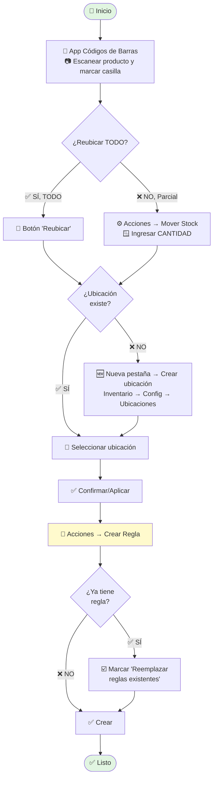

# Instructivo: Cómo Reubicar Productos con la App de Códigos de Barras

**Versión:** 3.0 | **Fecha:** Diciembre 2025 | **Dirigido a:** Operarios de almacén

---

## 🔄 Diagrama de Flujo

---

## 📋 PASOS SIMPLIFICADOS

### 1️⃣ Escanear Producto
- Abrir **App Códigos de Barras** (menú principal)
- 📷 **Escanear** el producto y **marcar su casilla** ☑️

### 2️⃣ Elegir Tipo de Reubicación

| ✅ TODO el stock | ❌ PARTE del stock |
|------------------|---------------------|
| 🔘 Clic en **"Reubicar"** | ⚙️ **Acciones** → **"Mover Stock"** 🔢 Ingresar **cantidad** en ventana emergente |

### 3️⃣ Ubicación Destino

| ✅ La ubicación EXISTE | ❌ La ubicación NO EXISTE |
|------------------------|---------------------------|
| 📍 Selecciónela directamente | 🆕 Nueva pestaña (Ctrl+T) 📂 **Inventario → Configuración → Ubicaciones → Crear** 💾 Guardar → ⬅️ Volver |

### 4️⃣ Confirmar
- ✅ Clic en **"Confirmar"** o **"Aplicar"**

### 5️⃣ Crear Regla de Almacenamiento
- ⚙️ **Acciones** → **"Crear Regla de Almacenamiento"**

| ✅ Ya tiene regla | ❌ NO tiene regla |
|-------------------|-------------------|
| ☑️ Marcar **"Reemplazar reglas existentes"** ✅ Clic en **"Crear"** | ✅ Clic en **"Crear"** |

---

## 📊 Tabla Resumen

| Paso | TODO el stock | PARTE del stock |
|------|---------------|-----------------|
| **1** | Escanear y marcar | Escanear y marcar |
| **2** | Botón "Reubicar" | Acciones → Mover Stock + Cantidad |
| **3** | Seleccionar destino | Seleccionar destino |
| **4** | Aplicar | Confirmar |
| **5** | Crear regla | Crear regla |

---

## ⚠️ Importante

- **Siempre crear la regla** después de reubicar
- **Si la ubicación no existe:** Créela en nueva pestaña sin cerrar la reubicación
- **Use el escáner** para evitar errores

---

**Creado por:** Jose D. Leonett | **GitHub:** github.com/josedleonett  
**GitHub:** https://github.com/josedleonett
